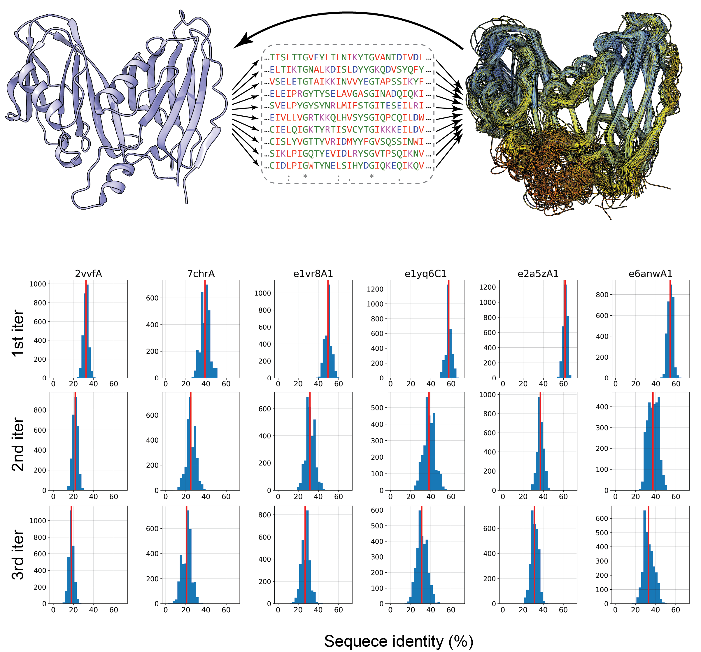

# Inverse ReFolding (IRF)
Inverse ReFolding (IRF) is an inverse folding-based algorithm for diverse multiple sequence alignment (MSA) generation. 

[ESM](https://github.com/facebookresearch/esm/tree/main) is required to run this code. 

  

